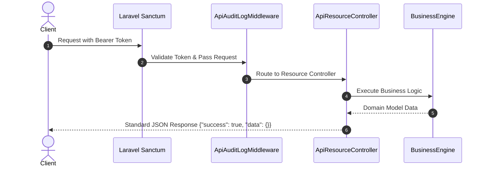

# API Platform Architecture — iC.edu Assessment Platform (IAP)

## Overview
The API Platform exposes RESTful JSON endpoints under `/api/v1` for external client integrations (Mobile Apps, LMS, HRIS, ERP).

## Flow Diagram

