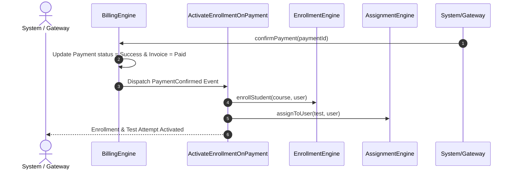

# Billing Architecture & Automatic Activation — iC.edu Assessment Platform (IAP)

## Overview
The Billing Engine (`BillingEngine.php`) handles payment confirmation, verifications, cancellations, and refunds.

## Flow Diagram

