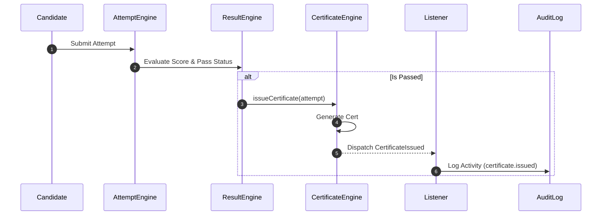

# Certificate Engine Architecture — IAP

## Overview
Certificate Engine mengelola pembuatan, penerbitan ulang, dan pencabutan sertifikat digital secara otomatis setelah peserta lulus evaluasi CBT.

---

## Flow Sequence Diagram

