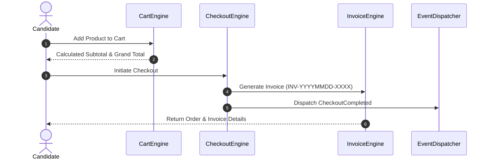

# Commerce Architecture — iC.edu Assessment Platform (IAP)

## Overview
The Commerce module (`app/Modules/Commerce/`) governs product management, catalog browsing, shopping cart operations, checkout processing, and ordering.

## Flow Diagram

