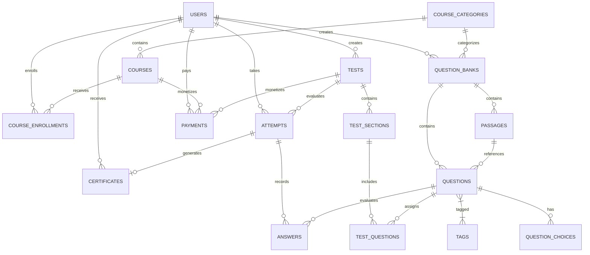

# Entity Relationship Diagram (ERD) — iC.edu Assessment Platform (IAP)

Dokumen ini mendeskripsikan struktur relasi database terpadu berbasis ULID di seluruh modul IAP.

---

## Tabel Domain & Deskripsi Utama

1. **`users`**: Tabel pengguna sistem (admin, teacher, student) dengan Spatie Role integration.
2. **`course_categories` & `courses`**: Pengorganisasian modul akademik dan kursus.
3. **`question_banks`**: Wadah kumpulan soal berdasarkan tipe ujian (TOEIC, TOEFL, IELTS, General).
4. **`passages`**: Teks bacaan/stimulus yang dapat dikaitkan dengan banyak soal.
5. **`questions`**: Soal ujian yang mendukung 12 tipe soal (*multiple choice*, *essay*, *speaking*, *listening*, dll.) dan tingkat kesulitan (*easy*, *medium*, *hard*).
6. **`question_choices`**: Pilihan jawaban untuk soal pilihan ganda/multi-response.
7. **`tests` & `test_sections`**: Struktur penyusunan ujian CBT (dengan batas waktu, passing score, dan opsi acak).
8. **`attempts` & `answers`**: Catatan sesi pengerjaan ujian peserta beserta skor dan umpan balik.
9. **`certificates`**: Bukti kelulusan ujian peserta.
10. **`payments`**: Transaksi pembayaran finansial kursus/ujian.
11. **`activity_logs` & `settings`**: Audit log kejadian sistem dan konfigurasi umum.
