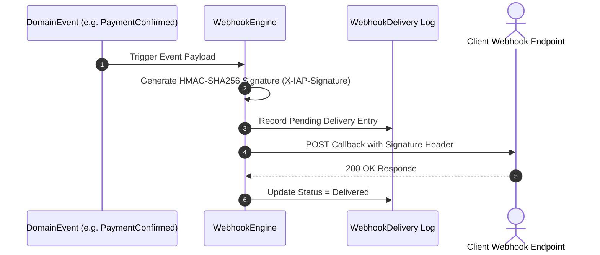

# Webhook Platform Architecture — iC.edu Assessment Platform (IAP)

## Overview
`WebhookEngine.php` dispatches signed HTTP POST callbacks to third-party endpoints.

## Sequence Diagram

```mermaid
sequenceDiagram
    autonumber
    participant Event as DomainEvent (e.g. PaymentConfirmed)
    participant Webhook as WebhookEngine
    participant Delivery as WebhookDelivery Log
    actor Target as Client Webhook Endpoint

    Event->>Webhook: Trigger Event Payload
    Webhook->>Webhook: Generate HMAC-SHA256 Signature (X-IAP-Signature)
    Webhook->>Delivery: Record Pending Delivery Entry
    Webhook->>Target: POST Callback with Signature Header
    Target-->>Webhook: 200 OK Response
    Webhook->>Delivery: Update Status = Delivered
```
